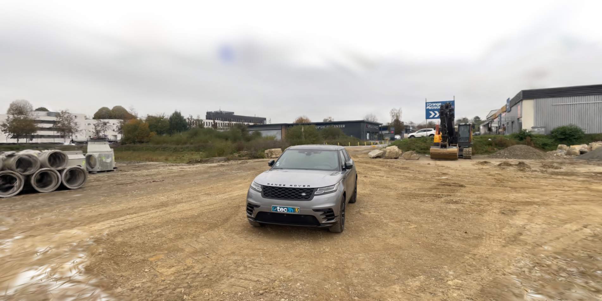
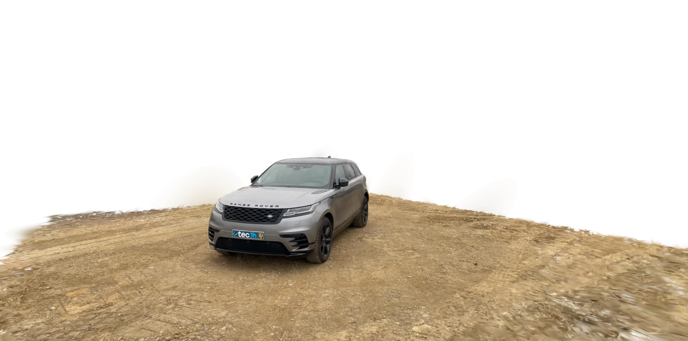

<h1 align="center">statCull</h1>

**Small CLI to remove outlier Gaussians from a 3DGS checkpoint and export a clean PLY.**

---

<p align="center">
  
  
</p>

## Installation

### Conda (recommended)

```bash
cd statCull
conda env create -f environment.yml
conda activate statcull
```

### Pip

```bash
cd statCull
python -m venv .venv
source .venv/bin/activate  # Windows: .venv\Scripts\activate
pip install -e .
```

## CLI Usage

```bash
statcull -ckpt <path/to/step-XXXXX.ckpt> \
         -o <output.ply> \
         -thr-x 0.2 --thr-y 0.2 --thr-z 1.0 \
```

* `-ckpt`: your 3DGS checkpoint file.
* `-o`: output PLY (default: `culled.ply`).
* `-thr-x/-thr-y/-thr-z`: z‑score thresholds for x, y, and z coordinates respectively.

**Output location**: By default, statCull writes the culled PLY to the outputs/ folder at the project root (it will be created if missing). Override with -o/--out if you want a different path.

## Input Checkpoint Path Structure

statCull only needs the path to a Nerfstudio/Splatfacto checkpoint (step-XXXXXXXXX.ckpt). A common layout looks like:

```
outputs/<SCENE_NAME>/splatfacto/<TIMESTAMP>/nerfstudio_models/step-000029999.ckpt
```

You can pass that full path directly to -ckpt. If you use the auto‑naming helper in the code, it derives the scene name from ancestor folders (e.g., <SCENE_NAME> above). If your structure differs, just give an explicit -o path.

